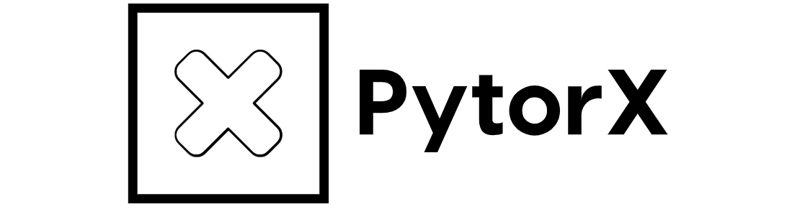

<p align="center">
  
</p>

<p align="center">PyTorX helps you evaluate Neural Network performance on ReRAM Crossbar Accelerators.</p>

[](https://zenodo.org/badge/latestdoi/169944698)

## Overview

PyTorX is a PyTorch-based framework for mapping neural networks onto resistive memory (ReRAM) crossbar arrays. It provides drop-in replacements for `nn.Conv2d` and `nn.Linear` that simulate realistic hardware non-ideal effects, enabling researchers to study accuracy degradation before physical deployment.

If you find this project useful, please cite [our work](https://arxiv.org/abs/1807.07948):

```bibtex
@inproceedings{He2019NIA,
  title={Noise Injection Adaption: End-to-End ReRAM Crossbar Non-ideal Effect Adaption for Neural Network Mapping},
  author={He, Zhezhi and Lin, Jie and Ewetz, Rickard and Yuan, Jiann-Shiun and Fan, Deliang},
  booktitle={Proceedings of the 56th Annual Design Automation Conference},
  pages={105},
  year={2019},
  organization={ACM}
}
```

## Features

- **Drop-in crossbar layers** -- `crxb_Conv2d` and `crxb_Linear` replace standard PyTorch layers
- **Non-ideal effect simulation** -- IR drop, thermal/RTN noise, stuck-at-fault (SAF), DAC/ADC quantization
- **Configurable precision** -- Independent control of input quantization (`quantize`) and ReRAM conductance levels (`weight_precision`)
- **GPU accelerated** -- Full CUDA support for training and inference
- **Multiple benchmarks** -- MNIST, CIFAR-10, and CIFAR-100 with VGG9 and ResNet-18 architectures

## Non-Ideal Effects Modeled

| Effect | Description | Flag |
|--------|-------------|------|
| **IR Drop** | Voltage drop due to wire resistance in the crossbar array | `--ir_drop` |
| **Thermal & RTN Noise** | Johnson-Nyquist thermal noise and random telegraph noise on conductance | `--enable_noise` |
| **Stuck-At-Fault (SAF)** | ReRAM cells permanently stuck at high or low conductance | `--enable_SAF` |
| **SAF Error Correction** | Compensation for SAF-affected cells | `--enable_ec_SAF` |
| **DAC/ADC Quantization** | Finite precision of digital-analog and analog-digital converters | `--quantize` |
| **Conductance Quantization** | Discrete conductance levels in ReRAM devices | `--weight_precision` |

## Project Structure

```
pytorx/
├── python/torx/module/       # Core ReRAM simulation modules
│   ├── layer.py               #   crxb_Conv2d and crxb_Linear layers
│   ├── w2g.py                 #   Weight-to-conductance conversion
│   ├── dac.py                 #   Digital-to-analog converter
│   ├── adc.py                 #   Analog-to-digital converter
│   ├── IR_solver.py           #   IR drop solver (Modified Nodal Analysis)
│   └── SAF.py                 #   Stuck-at-fault injection
├── benchmark/                 # Neural network benchmarks
│   ├── mnist.py               #   LeNet-style on MNIST
│   ├── cifar10.py             #   VGG9 on CIFAR-10
│   ├── cifar100.py            #   VGG9 on CIFAR-100
│   ├── resnet18_cifar10.py    #   ResNet-18 on CIFAR-10
│   └── resnet18_cifar100.py   #   ResNet-18 on CIFAR-100
├── run.sh                     # Run MNIST benchmark
├── run_cifar10.sh             # Run VGG9 CIFAR-10 benchmark
├── run_cifar100.sh            # Run VGG9 CIFAR-100 benchmark
├── run_resnet18_cifar10.sh    # Run ResNet-18 CIFAR-10 benchmark
├── run_resnet18_cifar100.sh   # Run ResNet-18 CIFAR-100 benchmark
└── test_all_benchmarks.py     # Smoke test for all models
```

## Dependencies

- Python >= 3.6
- PyTorch >= 1.1
- torchvision
- numpy, scipy, pandas

## Installation

Clone the repository and set the environment variables:

```bash
git clone https://github.com/anthropics/pytorx.git
cd pytorx

export PYTORX_HOME=$(pwd)
export PYTHONPATH=$PYTORX_HOME:$PYTORX_HOME/python:${PYTHONPATH}
export PYTHON=python3
```

Install dependencies:

```bash
pip install torch torchvision numpy scipy pandas
```

## Usage

### Quick Start

Run the MNIST benchmark:

```bash
bash run.sh
```

### Available Benchmarks

| Script | Model | Dataset | Default Epochs |
|--------|-------|---------|----------------|
| `run.sh` | LeNet | MNIST | 20 |
| `run_cifar10.sh` | VGG9 | CIFAR-10 | 200 |
| `run_cifar100.sh` | VGG9 | CIFAR-100 | 200 |
| `run_resnet18_cifar10.sh` | ResNet-18 | CIFAR-10 | 200 |
| `run_resnet18_cifar100.sh` | ResNet-18 | CIFAR-100 | 200 |

### Running Directly

```bash
python -m benchmark.mnist --epochs 20 --batch_size 1000 --crxb_size 64
```

### Enabling Non-Ideal Effects

```bash
# Inference with IR drop analysis
python -m benchmark.cifar10 --test --ir_drop --test_batch_size 50

# Inference with stuck-at-fault and error correction
python -m benchmark.cifar10 --test --enable_SAF --enable_ec_SAF

# Custom quantization precision
python -m benchmark.resnet18_cifar10 --epochs 200 --quantize 8 --weight_precision 4
```

### Common Arguments

| Argument | Default | Description |
|----------|---------|-------------|
| `--epochs` | varies | Number of training epochs |
| `--batch_size` | varies | Training batch size |
| `--lr` | varies | Learning rate |
| `--crxb_size` | 64 | Crossbar array dimension |
| `--vdd` | 3.3 | Supply voltage (V) |
| `--gwire` | 0.0357 | Wire conductance (S) |
| `--gload` | 0.25 | Load conductance (S) |
| `--gmax` | 0.000333 | Maximum ReRAM conductance (S) |
| `--gmin` | 0.000000333 | Minimum ReRAM conductance (S) |
| `--quantize` | 8 | DAC/ADC quantization bits |
| `--weight_precision` | None | ReRAM conductance bits (defaults to `quantize`) |
| `--freq` | 10e6 | Operating frequency (Hz) |
| `--temp` | 300 | Operating temperature (K) |
| `--ir_drop` | False | Enable IR drop analysis |
| `--enable_noise` | False | Enable stochastic noise |
| `--enable_SAF` | False | Enable stuck-at-fault |
| `--enable_ec_SAF` | False | Enable SAF error correction |
| `--test` | False | Inference-only mode (load checkpoint) |

### Running Tests

Verify all models can instantiate, forward, and backward:

```bash
python test_all_benchmarks.py
```

## Benchmark Architectures

### VGG9 (CIFAR-10 / CIFAR-100)

```
Conv(128) -> Conv(128) -> MaxPool ->
Conv(256) -> Conv(256) -> MaxPool ->
Conv(512) -> Conv(512) -> MaxPool ->
FC(1024) -> FC(1024) -> FC(num_classes)
```

All convolutions use 3x3 kernels with BatchNorm and ReLU. Trained with SGD + cosine annealing.

### ResNet-18 (CIFAR-10 / CIFAR-100)

Standard ResNet-18 adapted for 32x32 inputs (3x3 initial conv, no max pool). Four residual stages with [64, 128, 256, 512] channels and 2 BasicBlocks each. Trained with SGD + cosine annealing.

### MNIST Net

Lightweight 2-conv + 2-FC network. Trained with SGD + ReduceLROnPlateau.

## How It Works

PyTorX replaces standard PyTorch layers with crossbar-aware equivalents:

1. **DAC**: Input/weight tensors are quantized to fixed-point and converted to voltages
2. **Weight-to-Conductance**: Quantized weights are mapped to differential conductance pairs (G+, G-) on the crossbar
3. **Crossbar Computation**: Matrix-vector multiplication is performed in the analog domain, optionally with IR drop, noise, and SAF effects
4. **ADC**: Output currents are converted back to digital values

The layers are fully differentiable and support standard PyTorch training via backpropagation.

## License

Apache License 2.0. See [LICENSE](LICENSE) for details.
